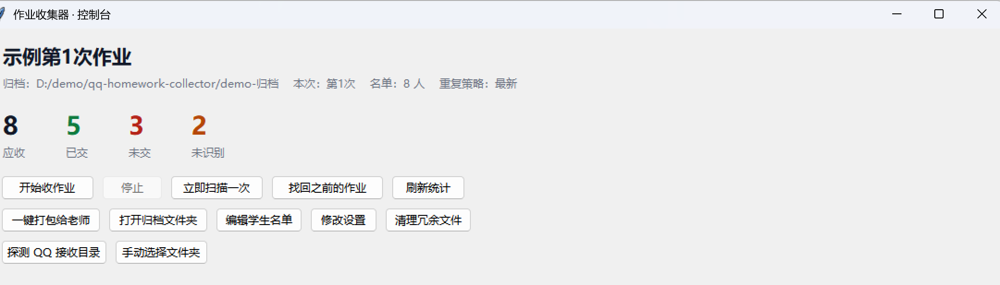

# qq-homework-collector · 课代表作业收集器

> 同学在 QQ 里发来的作业，自动认人 → 统一改名 → 按次数归文件夹 → 统计谁还没交。
> **纯 Python 标准库、零第三方依赖、不联网、不读聊天记录。**

你可能正经历这个场景：当上了课代表，30 多个同学把作业发到你的 QQ 里，
文件名五花八门 —— `高等数学+学号+姓名+第1次作业.pdf`、`作业(1).pdf`、`新建 文本文档.pdf`……

收完之后你要：一个个下载、对着名单核对谁交了、把文件名改成统一格式、
把没交的人整理成名单发老师。三十几个人下来能磨掉半小时，还容易看漏。

这个小工具把这套流程自动化了。

---

## 界面



四个大数字随时告诉你进度：**应收 / 已交 / 未交 / 未识别**。

---

## 它做什么

| 能做 | 说明 |
| --- | --- |
| **自动认人** | 从文件名里抠出学号，对上名单就知道是谁交的 |
| **统一改名** | `张三+学号+第1次作业.pdf` → `高等数学I第1次作业_2025000000001_张三.pdf` |
| **按次数分文件夹** | 自动建 `第1次作业\`、`第2次作业\`，不会全堆在一起 |
| **统计未交** | 生成 `_收集情况.csv`（每人一行）和 `_未交名单.csv`（可以直接发老师） |
| **补交幂等** | 同一个人重复提交，只留最新的，旧版本挪进 `_重复文件\` 留档不删 |
| **找回旧作业** | 打开程序**之前**收到的作业也能一次性全捞回来 |
| **一键打包** | 整理成一个干净的文件夹，直接交给老师 |
| **清理冗余** | 缓存 / 演练残留 / 重复副本，清进**回收站**（可还原），绝不动你的作业 |

## 它不做什么

- ❌ **不读聊天记录**。它只按文件名解析，永远不碰聊天内容。
- ❌ **不联网**。全程本地运行，没有任何网络请求。
- ❌ **不替你点"接收"**。QQ 收到文件后要你点一下"接收"才会落盘，程序替代的是"下载完之后手动整理"这一步。
- ❌ **不删你的作业**。清理功能只针对程序自己产生的缓存和重复副本，且全部走回收站。

---

## 快速开始

### 1. 环境要求

- **Python 3.9+**，且安装时勾选了 `tcl/tk and IDLE`（图形界面需要 tkinter）
- **零第三方依赖** —— 不需要 `pip install` 任何东西

> Windows 用户从 [python.org](https://www.python.org/downloads/) 下载安装时，
> 记得勾上 **Add python.exe to PATH** 和 **tcl/tk and IDLE**。

### 2. 拿到代码

```bash
git clone https://github.com/Aliejue/qq-homework-collector.git
cd qq-homework-collector
```

或者直接在 GitHub 页面点 **Code → Download ZIP**，解压到任意位置（路径别太长、别放中文目录）。

### 3. 先跑一次演练（不会碰你的真实文件）

```bash
python run.py demo
```

它会生成 11 个**假作业文件**并完整跑一遍流程，输出到 `demo-归档\`。
跑完打开看看成品长什么样 —— 这一步纯粹是让你放心，看完可以直接删掉 `demo-raw\`、`demo-归档\`。

### 4. 换成你自己的名单

打开 `学生名单.txt`，把里面的示例数据整体替换成你负责的同学：

```
2025000000001 张伟
2025000000002 王芳
2025000000003 李强
```

一行一个人，**学号 + 空格 + 姓名**，顺序随意。以 `#` 开头的行是注释，会被忽略。

> ⚠️ **这个文件决定了"应收"人数**。名单里有、作业没到 = 未交。

### 5. 开跑

**Windows**：双击 `start_gui.bat`
**macOS / Linux**：

```bash
python gui.py
```

然后点 **「开始收作业」**，窗口最小化挂着就行。

同学发作业 → 你在 QQ 里点一下「接收」→ 几秒后作业自动出现在归档文件夹里。

---

## 它去哪儿找文件

程序会同时盯着这几处，**并且每次启动时先把"打开程序之前"收到的旧作业捞一遍**：

| 位置 | 规则 |
| --- | --- |
| QQ 文件接收目录 | 自动探测（兼容 QQNT 新版和旧版路径） |
| 微信文件接收目录 | 自动探测 |
| `下载 / 桌面 / 文档` | 这几处"什么文件都有"，所以**只挑文件名里带名单学号的**，其他一律不碰 |
| 你手动指定的文件夹 | 完全信任，来什么收什么，认不出人的丢进 `_未识别\` 等你核对 |

> **路径自动探测**：程序用通配符匹配 `Documents\Tencent Files\<QQ号>\nt_qq\nt_data\File`，
> 所以换 QQ 号、换电脑都不用改配置。探测不准可以在设置里手动指定。

---

## 归档结果长什么样

```
作业归档\
├── 第1次作业\                              ← 按次数自动分文件夹
│   ├── 高等数学I第1次作业_2025000000001_张伟.pdf
│   ├── 高等数学I第1次作业_2025000000003_李强.pdf
│   └── ...
├── 第2次作业\
├── _未识别\                                ← 认不出是谁的，保留原文件名等你核对
├── _重复文件\                              ← 重复提交的旧版本，留档不删
├── _收集情况.csv                           ← 每人一行：学号/姓名/文件名/大小/时间
├── _未交名单.csv                           ← 只有没交的人，可以直接发老师
├── _处理记录.json                          ← 已处理文件清单（⚠️ 别删，见下）
└── _日志.log                               ← 每一步的流水账
```

两个 CSV 都是 **UTF-8 带 BOM**，双击用 Excel 打开不会乱码。

---

## 命令行速查

不想用图形界面的话：

```bash
python run.py            # 交互式菜单（推荐）
python run.py scan       # 立即扫描一次，整理已有文件
python run.py watch      # 后台常驻监控，来一个收一个
python run.py find       # 找回打开程序之前收到的旧作业
python run.py report     # 只出统计：收集明细 + 未交名单
python run.py pack       # 一键打包成可以交给老师的干净文件夹
python run.py clean      # 清理冗余文件（走回收站，可还原）
python run.py probe      # 探测 QQ 接收目录到底在哪
python run.py doctor     # 自检：打印当前配置和目录情况
python run.py demo       # 生成假数据演练（可反复跑）
```

**开机自启**：`Win + R` 输入 `shell:startup`，把 `start_gui.bat` 的**快捷方式**丢进去。

---

## 每换一次作业，记得改一处

这是最容易忘的一步：

> **停止 → 修改设置 → 把「作业名称」改成 `高等数学I第2次作业` → 开始收作业**

「作业名称」既是归档文件名的前缀，也是判断"该归进哪个子文件夹"的依据。
改名之后新作业自动进 `第2次作业\`，第一次的统计也不会被污染。

---

## 常见问题

**Q：能收到在程序打开之前发的作业吗？**
能。每次点「开始收作业」都会先自动搜一遍，也可以手动点「找回之前的作业」。

**Q：会不会把我自己的文件也收进去？**
不会。下载 / 桌面 / 文档这类"混合目录"**只挑文件名里带名单学号的**，
课表、竞赛资料、安装包都会被无视。

**Q：QQ 里收到的文件为什么没出现在接收文件夹里？**
因为**你还没点"接收"**。QQ 收到文件后默认只弹个提示，点了接收才真正落盘。

**Q：`_处理记录.json` 能删吗？**
**不能**。它记录了哪些文件已经处理过。删掉之后，如果来源文件还在，
程序会重新处理一遍（作业不会丢，但 `_重复文件\` 里会多出副本）。
`_收集情况.csv`、`_未交名单.csv` 则可以随便删，下次扫描自动重建。

**Q：想连"点接收"这一步都省掉？**
项目里附带了 `qq_bot.py`（基于 NapCat / OneBot11 的机器人方案），
让机器人直接监听群消息、收到文件就归档。
**但这条路涉及第三方协议登录，有账号风控风险，请自行评估，本项目不建议日常使用。**

**Q：它到底会不会偷偷上传我的数据？**
不会。全项目只依赖 Python 标准库，**没有任何网络请求代码**，你可以自己搜一遍 `urllib` / `requests` / `socket`。

---

## 安全与隐私

这个工具会接触到真实的师生信息，所以有几条请务必注意：

- **不要把你填好的 `学生名单.txt` 提交到公开仓库** —— 那里面是全班同学的姓名和学号。
  本项目自带的 `学生名单.txt` 是**假数据**，你本地替换后请注意不要 push。
- **不要提交 `作业归档\` 目录** —— 里面是同学们的作业原件。`.gitignore` 已经默认排除。
- 分享 / 交接这个工具时，记得清掉名单和归档，见《操作说明书》第 9.9 节。

---

## 项目结构

| 文件 | 作用 |
| --- | --- |
| `collector.py` | 核心逻辑：识别、改名、去重、归档、统计、清理 |
| `run.py` | 命令行入口 + 文字菜单 |
| `gui.py` | tkinter 图形控制台 |
| `launch_gui.py` | 图形界面启动器（自动挑一个带 tkinter 的 Python） |
| `qq_bot.py` | 可选的 QQ 机器人方案（需自备 NapCat） |
| `config.json` | 全部配置 |
| `学生名单.txt` | 学生名单（示例数据，用前替换） |
| `学生名单-示例.txt` | 演练专用名单，只被 `run.py demo` 读取 |
| `start_gui.bat` / `start.bat` / `start_bot.bat` | Windows 双击启动 |
| `操作说明书.md` | **详细说明书**：12 个按钮逐个讲、故障排查表、迁移指南 |
| `运行产物审查报告.md` | 程序会产生哪些文件、哪些算垃圾的实测报告 |

**强烈建议读一读 [《操作说明书》](操作说明书.md)** —— 里面有完整的按钮说明、
12 条故障排查、以及换电脑 / 换班 / 换课程 / 交接给别人的迁移指南。

---

## 兼容性

| 项目 | 情况 |
| --- | --- |
| Python | 3.9+（开发与实测环境 3.13 / 3.14） |需要py环境
| 操作系统 | Windows 优先（回收站、QQ 目录探测等为 Windows 优化）；核心逻辑跨平台 |
| QQ | 兼容 QQNT 新版目录结构，旧版 `FileRecv` 也可手动指定 |
| 第三方依赖 | **无** |

## 迁移性

整个程序**没有任何硬编码的用户名或绝对路径** —— 位置全靠"程序自己所在目录"和"当前用户主目录"推导，
配置里的归档目录默认是相对路径。

所以：**想搬家，整个文件夹剪走就行**，配置一个字都不用改，归档和统计跟着走。

换电脑、换 QQ 号、换班、换课程、交接给别人的完整流程，见
[《操作说明书》第 9 章](操作说明书.md)。

---

## License

[MIT](LICENSE)
